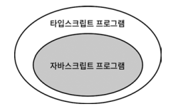

# Introduction

타입스크립트의 타입들은 어떤 타입이 가능한지 등 알아 본다.

> Duck Typing
>
> > 객체가 무엇을 할 수 있는지 없는지 타입으로 구분 하는 것  
> >  하나는 상속을 받은 클래스, 하는 상속 받지 않은 클래스인 경우  
> >  두개의 클래스가 같은 출력 결과가 나온다면 같은 타입으로 볼 수 있다는 것.

- 타입스크립트는 인터프리터로 실행되지 않고, 저수준 언어로 컴파일 되는 것이 아니다.
  고수준 언어인 자바스크립트로 컴파일이 되며 실행 역시 자바스크립트로 이루어 진다.
  때문에 타입스크립트와 자바스크립트의 관계는 필연적이며, 이 밀접한 관계 때문에 혼란스러운 일이 벌어진다.
  그래서 이 관계를 잘 이해한다면 타입스크립트 개발자로서 한 단계 성장 할 수 있다.

- 타입스크립트의 타입 시스템의 특징들은 자세히 알아둬야 한다.

---

<br>

# Item. 1

## 타입스크립트와 자바스크립트의 관계 이해

- 타입스크립트는 자바스크립의 상위 집합(superset)이다.
  <sub>superset : 수학용어에서 상위집합, 초집합으로 불리며 자바스크립트는 타입스크립트의 부분 집합(subset)으로 이해할 수 있다.</sub>
  그래서 파일 명을 `main.js` 를 `main.ts`로 바꾸는 것이 가능하다.
  이는 자바스크립트를 타입스크립트로 마이그레이션(migration) 하는데 엄청난 이점이 된다.
  하지만 반대로는 다시 처음부터 작성 하는게 빠르다고 할 정도로 힘들다고 한다.

- 모든 자바스크립트 프로그램이 타입스크립트라는 명제는 참, 반대는 성립하지 않는다.

예시로

```typescript
function hello(name: string) {
  console.log("Hello ", name);
}
```

위의 타입스크립트 에서는 문제가 없지만 아래의 자바스크립트에서는 오류가 출력된다.

```javascript
function hello(name: string) {
  //               ^ 해당 부분에서 SyntaxError: Unexpected token :
  //                 이런 오류가 출력 될 것이다.
  console.log("Hello ", name);
}
```

<p align="center"><b>확인 결과 (ts8010)</b></p>

- `: string`은 타입스크립트 에서 많이 쓰이는 타입 구문, 타입스크립트를 사용하는 javascript는 typescript 영역으로 들어가게 된다.
<p align="center">자바스크립트 < 타입스크립트 </p>

- 타입스크립트는 초기 값으로 타입을 추론한다.
  타입시스템의 목표 중 하나는 런타임에 오류를 발생시킬 코드를 미리 찾아 내는 것.
  이는 타입스크립트가 **정적** 타입 시스템이라 불리는게 이런 특징이다.

- **명시적 의도**
- 먼저 타입 추론이 아닌 명시적으로 타입을 선언해서 의도를 분명하게 해놓는 다면 타입스크립트가
  오류발생 위치와 제대로된 해결책을 제시 할 수 있다.

  ```typescript
  interface info {
    name: string;
    job: string;
  }
  const list: info[] = [
    { name: "John", job: "student" }, // 먼저 명시적 의도를 정했기 때문에 오류의 원인과 해결책을
    { name: "Newton", jab: "none" }, // 제대로 확인할 수 있다.
    { name: "David", jab: "professor" },
  ];
  ```

- 작성된 프로그램이 타입 체크를 통과하더라도 오류가 발생할 수 있다.

```typescript
const names = ["a", "b"];
console.log(names[2].toUpperCase());
// 실행 시
// TypeError: Cannot read property 'toUpperCase' of undefined
```

<b>앞으로도 계속 볼 수 있는 흔한 에러인 `TypeError: Cannot read property` 이다.</b>
<br>

그리고 앞서 나왔던 오류가 발생하는 근본적인 원인은 타입스크립트가 이해하는 값의 타입과 실제 값에 차이가 있기 때문이다.
타입 시스템은 **정적 타입의 정확성을 보장해주지 않는다.**

---

# Item. 2

## 타입스크립트 설정 이해

타입스크립트 옵션 설정은 커맨드 라인을 이용하는 것 보다 `tsconfig.json`을 사용하는 것이 좋다.

```typescript
function plus(a, b) {
  return a + b;
}
plus(10, null);
```

위의 코드는 타입스크립트에서 `noImplicitAny: false` 일때는 문제가 발생이 안된다.
위의 `plus` 함수를 타입스크립트에서 추론한 타입은 다음과 같다
`function plus(a: any, b: any): any`

any 타입의 매개변수 앞에서는 타입 체커는 무력해진다. any는 유용할 수 있지만 매우 주의해서 사용해야 한다.
그래서 다시 이어가면 `noImplicitAny` 옵션을 `true`로 사용하면 오류가 발생되며, `any`라고 선언해 주거나 더 분명한 타입을 사용하면 오류를 해결 할 수 있다.

```typescript
function plus(a: number, b: number) {
  return a + b;
}
```

하지만 `plus(10, null)` 은 `strictNullChecks` 옵션에 의해 `null`은 `number` 타입에 할당 할 수 없다.
그 외에도 `items2-1.ts` 에 예시 코드작성 확인.
`strictnullChecks`는 `null`과 `undefined` 관련된 오류를 잡아 내는 데 많은 도움이 되지만, 코드 작성을 어렵게 만든다.
프로젝트를 새로 시작하면 이 옵션을 설정해서 진행하면 좋지만, 타입스크립트가 처음이고 자바스크립트 코드를 마이그레이션 하는 중이라면 설정하지 않아도 괜찮다고 한다. ~~라고 하지만 해라~~

`strictNullChecks` 옵션은 `noImplicitAny`를 먼저 설정해야 한다. 가능한 한 초반에 설정하는게 좋다. 런타임 오류를 방지하기 위해서...
`strict` 옵션을 설정하면 대부분의 오류를 잡아낸다.

# Item. 3

## 코드 생성과 타입이 관계없는 것

타입스크립트 컴파일러는 두 가지 역할 수행

1. 최신 타입/자바스크립트를 브라우저에서 동작할 수 있도록 구버전의 자바스크립트로 `Transpile(Translate + Compile)`
2. 코드 타입 오류 체크

이 두 가지는 서로 독립적이다. 즉 컴파일 할때의 코드 내 타입에는 영향을 주지않고 실행 시점에도 타입은 영향을 받지 않는다.<br>
이를 본다면 타입스크립트가 **할 수 있는 일**과 **할 수 없는 일**을 짐작 할 수 있다.

### 타입 오류가 있는 코드도 컴파일이 가능하다.

컴파일은 타입 체크와 독립적으로 동작하기 때문에 타입 오류가 있는 코드도 컴파일이 가능하다.

```typescript
// ts file
let x = "hello";
x = 10;
```

```typescript
// tsc file
let x = "hello";
x = 10; // 해당 부분에서 TS2322 ERROR가 발생. 다른 형식이기 때문.
```

```javascript
// js file
let x = "hello";
x = 1234;
```

타입스크립트 오류는 경고와 비슷하다. 문제가 될 만한 부분을 알려 주지만 빌드를 멈추지는 않는다.

> 보통 코드 오류에서 컴파일에 문제가 있다고 하는 경우는 타입 체크에 문제가 있다고 하는 것으로 이해하면 된다.

허나 이는 컴파일된 산출물이 나오는 것이 실제로 도움이 되는 경우가 있고, 다른 부분을 테스트 할 수 있다. 오류가 있을 때 컴파일 하지 않으려면 `tsconfig.json`에 `**noEmitOnError**` 옵션을 설정하거나 빌드 도구에 동일하게 적용하면 된다.

### 런타임에는 타입 체그가 불가능하다.

`instanceof` 체크는 런타임에 일어나지만 `type`으로 생성된 내용은 런타임 시점에 아무런 역할을 할 수 없다.
실제로 Typescript가 Javascript로 컴파일 되는 과정에는 `interface`, `type` 같은 타입 속성은 제거된 상태로 컴파일이 되기 때문에 타입을 명확하게 하는게 중요하다.

```typescript
interface One {
  first: number;
}
interface Two extends One {
  second: number;
}
type Check = One | Two;

function typeChecker(check: Check) {
  if ("first" in check) {
    return check.first * check.second;
  } else {
    return check.second;
  }
}
```

아니면 런타임에 접근 가능한 타입 정보를 `명시적으로 저장`하는 `태그` 기법이 있다.

```typescript
interface One {
  def: "one";
  first: number;
}
interface Two extends One {
  def: "two";
  second: number;
  first: number;
}

type Check = One | Two;

function typeChecker(check: Check) {
  if (check.def === "two") {
    return check.first * check.second;
  } else {
    return check.first;
  }
}
```

`Check`는 `태그된 유니온(tagged union)` 의 예이며, 런타임에 타입 정보를 손쉽게 유지할 수 있기 때문에 타입스크립트에서 흔하게 볼 수 있다.
타입(런타임 X)과 값(런타임 O)은 둘 다 사용하는 기법도 있는데, 타입을 `클래스`로 만들면 해결이 된다.

```typescript
class One {
  constructor(public first: number) {}
}
class Two extends One {
  constructor(public second: number, public first: number) {
    super(first);
  }
}
type Check = One | Two;
```

### 타입 연산은 런타임에 영향을 주지 않는다

string 또는 number 타입인 값을 항상 number로 정제하는 경우를 보면

```typescript
const asNumber1: number = (value: string | number) => {
  return value as number;
};
const asNumber2: number = (value: string | number) => {
  return typeof val === "string" ? Number(value) : value;
};
```

asNumber1의 코드는 타입 체커를 통과하지만 잘못된 방법이고, asNumber2 방식으로 해야 한다.

### 런타임 타입은 선언된 타입과 다를 수 있다

### 타입스크립트 타입으로는 함수를 오버로드할 수 없다

### 타입스크립트 타입은 런타임 성능에 영향을 주지 않는다
