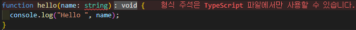

# Introduction

타입스크립트의 타입들은 어떤 타입이 가능한지 등 알아 본다.

> Duck Typing
>
> > 객체가 무엇을 할 수 있는지 없는지 타입으로 구분 하는 것  
> >  하나는 상속을 받은 클래스, 하는 상속 받지 않은 클래스인 경우  
> >  두개의 클래스가 같은 출력 결과가 나온다면 같은 타입으로 볼 수 있다는 것.

- 타입스크립트는 인터프리터로 실행되지 않고, 저수준 언어로 컴파일 되는 것이 아니다.
  고수준 언어인 자바스크립트로 컴파일이 되며 실행 역시 자바스크립트로 이루어 진다.
  때문에 타입스크립트와 자바스크립트의 관계는 필연적이며, 이 밀접한 관계 때문에 혼란스러운 일이 벌어진다.
  그래서 이 관계를 잘 이해한다면 타입스크립트 개발자로서 한 단계 성장 할 수 있다.

- 타입스크립트의 타입 시스템의 특징들은 자세히 알아둬야 한다.

---

<br>

# Item. 1

## 타입스크립트와 자바스크립트의 관계 이해

- 타입스크립트는 자바스크립의 상위 집합(superset)이다.
  <sub>superset : 수학용어에서 상위집합, 초집합으로 불리며 자바스크립트는 타입스크립트의 부분 집합(subset)으로 이해할 수 있다.</sub>
  그래서 파일 명을 `main.js` 를 `main.ts`로 바꾸는 것이 가능하다.
  이는 자바스크립트를 타입스크립트로 마이그레이션(migration) 하는데 엄청난 이점이 된다.
  하지만 반대로는 다시 처음부터 작성 하는게 빠르다고 할 정도로 힘들다고 한다.

- 모든 자바스크립트 프로그램이 타입스크립트라는 명제는 참, 반대는 성립하지 않는다.

예시로

```typescript
function hello(name: string) {
  console.log("Hello ", name);
}
```

위의 타입스크립트 에서는 문제가 없지만 아래의 자바스크립트에서는 오류가 출력된다.

```javascript
function hello(name: string) {
  //               ^ 해당 부분에서 SyntaxError: Unexpected token :
  //                 이런 오류가 출력 될 것이다.
  console.log("Hello ", name);
}
```

<p align="center"><b>확인 결과 (ts8010)</b></p>

- `: string`은 타입스크립트 에서 많이 쓰이는 타입 구문, 타입스크립트를 사용하는 javascript는 typescript 영역으로 들어가게 된다.
<p align="center">자바스크립트 < 타입스크립트 </p>

- 타입스크립트는 초기 값으로 타입을 추론한다.
  타입시스템의 목표 중 하나는 런타임에 오류를 발생시킬 코드를 미리 찾아 내는 것.
  이는 타입스크립트가 **정적** 타입 시스템이라 불리는게 이런 특징이다.

- **명시적 의도**
- 먼저 타입 추론이 아닌 명시적으로 타입을 선언해서 의도를 분명하게 해놓는 다면 타입스크립트가
  오류발생 위치와 제대로된 해결책을 제시 할 수 있다.

  ```typescript
  interface info {
    name: string;
    job: string;
  }
  const list: info[] = [
    { name: "John", job: "student" }, // 먼저 명시적 의도를 정했기 때문에 오류의 원인과 해결책을
    { name: "Newton", jab: "none" }, // 제대로 확인할 수 있다.
    { name: "David", jab: "professor" },
  ];
  ```

- 작성된 프로그램이 타입 체크를 통과하더라도 오류가 발생할 수 있다.

```typescript
const names = ["a", "b"];
console.log(names[2].toUpperCase());
// 실행 시
// TypeError: Cannot read property 'toUpperCase' of undefined
```

<b>앞으로도 계속 볼 수 있는 흔한 에러인 `TypeError: Cannot read property` 이다.</b>
<br>

그리고 앞서 나왔던 오류가 발생하는 근본적인 원인은 타입스크립트가 이해하는 값의 타입과 실제 값에 차이가 있기 때문이다.
타입 시스템은 **정적 타입의 정확성을 보장해주지 않는다.**

---

# Item. 2
